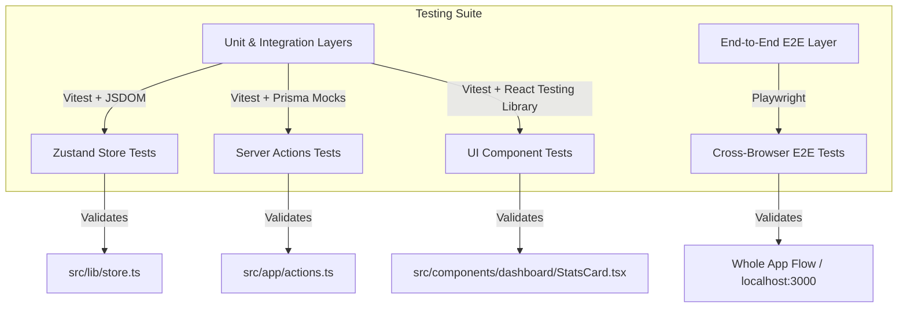

# 🧪 Jarvis OS — Testing Framework & Preparation Guide

Welcome to the **Testing Phase** of Jarvis OS. To prepare the project for a robust and high-quality testing phase, we have integrated a modern, fast, and unified testing system comprising **Vitest** (for ultra-fast unit/integration tests) and **Playwright** (for production-grade E2E browser tests).

This guide outlines the architecture of our test suite, details the configuration files created, and shows you how to run and write tests.

---

## 🏗️ Testing Architecture Overview

We have structured the testing suite to cover all layers of the Jarvis OS stack, ensuring that UI components, server logic, database interactions, and client-side state are fully validated.



---

## 📁 Testing Files & Structure

We have added the following configurations and tests to the project:

### 1. Configuration & Setup
* **[vitest.config.ts](./vitest.config.ts)**: Configures Vitest with React plugin support, path alias resolution (`@/*`), and JSDOM environment.
* **[vitest.setup.ts](./vitest.setup.ts)**: Mocks Next.js core APIs (`next/navigation`, `next/cache`), suppresses React 19 warnings in JSDOM, and extends Vitest with Jest-DOM matchers.
* **[playwright.config.ts](./playwright.config.ts)**: Playwright E2E configuration, targeting multi-browser execution (Chromium, Firefox, Webkit/Safari) and automatic dev-server booting.

### 2. Ready-to-Run Test Suites
* **[store.test.ts](./src/__tests__/store.test.ts)**: Unit tests for state updates and Zustand store actions (e.g. `addProject`, `updateTask`, `updateGoal`).
* **[actions.test.ts](./src/__tests__/actions.test.ts)**: Tests Next.js Server Actions with mock Prisma clients to isolate database logic and mock CRUD operations.
* **[StatsCard.test.tsx](./src/components/dashboard/__tests__/StatsCard.test.tsx)**: Validates standard React component rendering, trend states, units, and progress bar calculations under React 19.
* **[dashboard.spec.ts](./tests/dashboard.spec.ts)**: Evaluates layout renders, responsive sidebar controls, page titles, and route navigations inside real chromium/firefox/webkit environments.

---

## 🚀 Running the Tests

New scripts have been added directly to your [package.json](./package.json). Execute them using npm:

### ⚙️ Unit & Integration Tests (Vitest)

| Command | Action | Description |
| :--- | :--- | :--- |
| `npm run test` | **Run Once** | Executes the entire unit/integration test suite and returns results. |
| `npm run test:watch` | **Watch Mode** | Launches the interactive test runner that dynamically re-runs tests on save. |
| `npm run test:coverage` | **Coverage** | Generates a coverage report showing code paths covered (outputs HTML report). |

> [!TIP]
> If you have Vitest UI installed locally or globally, you can also run `npx vitest --ui` to open a stunning, interactive browser dashboard showing all your tests running in real-time with code peek and dependency graphs!

### 🌐 End-to-End Tests (Playwright)

Playwright will automatically boot up your development server `npm run dev` in the background, run the tests, and shut down the server when finished.

| Command | Action | Description |
| :--- | :--- | :--- |
| `npx playwright install` | **Setup** | Downloads browser binaries (Chromium, Firefox, Webkit) required for Playwright. *(Run this once before E2E testing)* |
| `npm run test:e2e` | **Run E2E** | Runs E2E tests headlessly on all configured browsers. |
| `npm run test:e2e:ui` | **E2E UI Mode** | Opens Playwright's visual dashboard for stepping through E2E tests line-by-line with timetravel debugging. |

---

## 💡 Best Practices for Writing Tests

### Mocking Prisma in Server Actions
When testing actions in `src/app/actions.ts`, mock Prisma Client methods to prevent tests from writing to your actual development database. 
```typescript
import { vi } from 'vitest';
import { prisma } from '../lib/prisma';

vi.mock('../lib/prisma', () => ({
  prisma: {
    project: {
      create: vi.fn(),
    }
  }
}));

// Inside your test:
vi.mocked(prisma.project.create).mockResolvedValue(mockProjectData);
```

### Resetting Zustand Store
Between unit tests, always clear/reset the Zustand store state so tests do not leak state or affect each other:
```typescript
import { useStore } from '../lib/store';

beforeEach(() => {
  useStore.setState({
    projects: [],
    tasks: [],
    // ... reset other keys
  });
});
```

---

## 🎯 Next Steps for the Test Phase

1. **Run `npm run test`** to verify all unit/integration tests run instantly.
2. **Run `npx playwright install`** followed by `npm run test:e2e` to execute browser-level verification.
3. Continue adding tests for new dashboard features (e.g. `RoutineTracker`, `PerformanceCharts`, or `KnowledgeContext`) using the patterns established in `StatsCard.test.tsx`.
